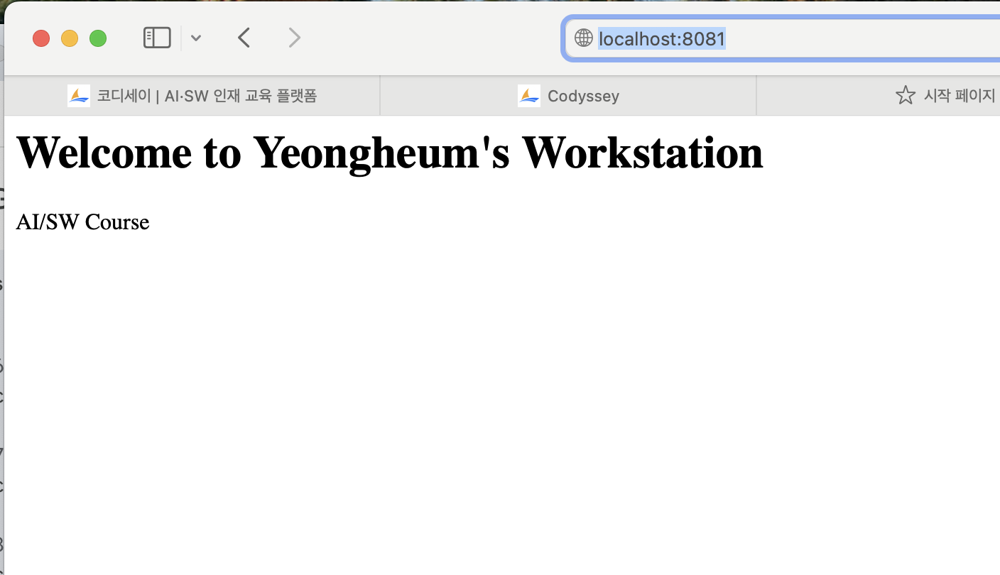

# 미션 1-1
# AI/SW 개발 워크스테이션 구축 미션

## 1. 실행 환경
* OS: macOS
* Shell: zsh (Mac 터미널 기본)
* Docker: version 28.5.2
* Git: 2.53.0

## 2. 수행 항목 체크리스트
- [x] 터미널 기본 조작 및 폴더 구성
- [x] 권한 변경 실습
- [ ] Docker 설치/점검
- [ ] hello-world 실행
- [ ] Dockerfile 빌드/실행
- [ ] 포트 매핑 접속(2회)
- [ ] 바인드 마운트 반영
- [ ] 볼륨 영속성
- [ ] Git 설정 + VSCode GitHub 연동

---

## 3. 수행 로그 및 증거

### (1) 실행 환경 확인
```bash
# 1. macOS 버전 확인
sw_vers
ProductName:            macOS
ProductVersion:         15.7.4
BuildVersion:           24G517
# 2. Docker 버전 확인
docker --version
Docker version 28.5.2, build ecc6942
# 3. Git 버전 확인
git --version
git version 2.53.0

### (2) 터미널 조작 및 권한 실습
```bash
# 1. 현재 위치 확인 *pwd: print working directory
skdudgma110846@c6r3s8 Codyssey % pwd
/Users/skdudgma110846/Codyssey
# 2. 폴더 생성 후 이동 *mkdir: make directory, cd: change directory
skdudgma110846@c6r3s8 Codyssey % mkdir practice_dir
skdudgma110846@c6r3s8 Codyssey % cd practice_dir
# 3. 빈 텍스트 파일 생성 *touch 파일명
skdudgma110846@c6r3s8 practice_dir % touch test.txt
# 4. 파일 목록과 현재 관한 *ls -la: list -(옵션) 'l':long format(권한 등의 상세정보), 'a': all(숨김 파일 까지)
skdudgma110846@c6r3s8 practice_dir % ls -la
total 0
drwxr-xr-x  3 skdudgma110846  skdudgma110846   96 Apr 10 02:58 .
drwxr-xr-x  5 skdudgma110846  skdudgma110846  160 Apr 10 02:58 ..
-rw-r--r--  1 skdudgma110846  skdudgma110846    0 Apr 10 02:58 test.txt
# 5. 파일 권한 변경 *chmod 숫자 대상파일 - r(읽기,4) w(쓰기.2) x(실행,1) -755(본인은 rwx 다 가능, 그룹과 타인은 읽기와 실행만 가능)
skdudgma110846@c6r3s8 practice_dir % chmod 755 test.txt
skdudgma110846@c6r3s8 practice_dir % ls -la
total 0
drwxr-xr-x  3 skdudgma110846  skdudgma110846   96 Apr 10 02:58 .
drwxr-xr-x  5 skdudgma110846  skdudgma110846  160 Apr 10 02:58 ..
-rwxr-xr-x  1 skdudgma110846  skdudgma110846    0 Apr 10 02:58 test.txt
skdudgma110846@c6r3s8 Codyssey % cd practice_dir
# 6. 빈 파일 글씨 넣고 내용 확인( 해당 파일 없으면 생성 ) *ehco " " > 파일명
skdudgma110846@c6r3s8 practice_dir % echo "Hello" > test.txt
skdudgma110846@c6r3s8 practice_dir % cat test.txt
Hello
# 7. 파일 복사 *cp
skdudgma110846@c6r3s8 practice_dir % cp test.txt copy_test.txt
skdudgma110846@c6r3s8 practice_dir % ls -la
total 16
drwxr-xr-x  4 skdudgma110846  skdudgma110846  128 Apr 10 03:08 .
drwxr-xr-x  5 skdudgma110846  skdudgma110846  160 Apr 10 02:58 ..
-rwxr-xr-x  1 skdudgma110846  skdudgma110846    6 Apr 10 03:08 copy_test.txt
-rwxr-xr-x  1 skdudgma110846  skdudgma110846    6 Apr 10 03:08 test.txt
# 8. 파일 이름 변경 *mv
skdudgma110846@c6r3s8 practice_dir % mv copy_test.txt rename_test.txt
skdudgma110846@c6r3s8 practice_dir % ls -la
total 16
drwxr-xr-x  4 skdudgma110846  skdudgma110846  128 Apr 10 03:09 .
drwxr-xr-x  5 skdudgma110846  skdudgma110846  160 Apr 10 02:58 ..
-rwxr-xr-x  1 skdudgma110846  skdudgma110846    6 Apr 10 03:08 rename_test.txt
-rwxr-xr-x  1 skdudgma110846  skdudgma110846    6 Apr 10 03:08 test.txt
# 9. 복사 파일 삭제 *rm
skdudgma110846@c6r3s8 practice_dir % rm rename_test.txt
skdudgma110846@c6r3s8 practice_dir % ls -la
total 8
drwxr-xr-x  3 skdudgma110846  skdudgma110846   96 Apr 10 03:09 .
drwxr-xr-x  5 skdudgma110846  skdudgma110846  160 Apr 10 02:58 ..
-rwxr-xr-x  1 skdudgma110846  skdudgma110846    6 Apr 10 03:08 test.txt
skdudgma110846@c6r3s8 practice_dir % cd ..
```

### (3) Docker 기본 점검 및 컨테이너 실행 실습
```bash
# 1. Docker 데몬 상태 확인
skdudgma110846@c6r3s8 Codyssey % docker info
Client:
 Version:    28.5.2
 Context:    orbstack
 Debug Mode: false
 Plugins:
  buildx: Docker Buildx (Docker Inc.)
    Version:  v0.29.1
    Path:     /Users/skdudgma110846/.docker/cli-plugins/docker-buildx
  compose: Docker Compose (Docker Inc.)
    Version:  v2.40.3
    Path:     /Users/skdudgma110846/.docker/cli-plugins/docker-compose

Server:
 Containers: 1
  Running: 0
  Paused: 0
  Stopped: 1
 Images: 1
 Server Version: 28.5.2
 Storage Driver: overlay2
  Backing Filesystem: btrfs
  Supports d_type: true
  Using metacopy: false
  Native Overlay Diff: true
  userxattr: false
 Logging Driver: json-file
 Cgroup Driver: cgroupfs
 Cgroup Version: 2
 Plugins:
  Volume: local
  Network: bridge host ipvlan macvlan null overlay
  Log: awslogs fluentd gcplogs gelf journald json-file local splunk syslog
 CDI spec directories:
  /etc/cdi
  /var/run/cdi
 Swarm: inactive
 Runtimes: runc io.containerd.runc.v2
 Default Runtime: runc
 Init Binary: docker-init
 containerd version: 1c4457e00facac03ce1d75f7b6777a7a851e5c41
 runc version: d842d7719497cc3b774fd71620278ac9e17710e0
 init version: de40ad0
 Security Options:
  seccomp
   Profile: builtin
  cgroupns
 Kernel Version: 6.17.8-orbstack-00308-g8f9c941121b1
 Operating System: OrbStack
 OSType: linux
 Architecture: x86_64
 CPUs: 6
 Total Memory: 15.67GiB
 Name: orbstack
 ID: 487a21b2-8630-4418-bb4e-c1e8aed17a3b
 Docker Root Dir: /var/lib/docker
 Debug Mode: false
 Experimental: false
 Insecure Registries:
  ::1/128
  127.0.0.0/8
 Live Restore Enabled: false
 Product License: Community Engine
 Default Address Pools:
   Base: 192.168.97.0/24, Size: 24
   Base: 192.168.107.0/24, Size: 24
   Base: 192.168.117.0/24, Size: 24
   Base: 192.168.147.0/24, Size: 24
   Base: 192.168.148.0/24, Size: 24
   Base: 192.168.155.0/24, Size: 24
   Base: 192.168.156.0/24, Size: 24
   Base: 192.168.158.0/24, Size: 24
   Base: 192.168.163.0/24, Size: 24
   Base: 192.168.164.0/24, Size: 24
   Base: 192.168.165.0/24, Size: 24
   Base: 192.168.166.0/24, Size: 24
   Base: 192.168.167.0/24, Size: 24
   Base: 192.168.171.0/24, Size: 24
   Base: 192.168.172.0/24, Size: 24
   Base: 192.168.181.0/24, Size: 24
   Base: 192.168.183.0/24, Size: 24
   Base: 192.168.186.0/24, Size: 24
   Base: 192.168.207.0/24, Size: 24
   Base: 192.168.214.0/24, Size: 24
   Base: 192.168.215.0/24, Size: 24
   Base: 192.168.216.0/24, Size: 24
   Base: 192.168.223.0/24, Size: 24
   Base: 192.168.227.0/24, Size: 24
   Base: 192.168.228.0/24, Size: 24
   Base: 192.168.229.0/24, Size: 24
   Base: 192.168.237.0/24, Size: 24
   Base: 192.168.239.0/24, Size: 24
   Base: 192.168.242.0/24, Size: 24
   Base: 192.168.247.0/24, Size: 24
   Base: fd07:b51a:cc66:d000::/56, Size: 64

WARNING: DOCKER_INSECURE_NO_IPTABLES_RAW is set
# 2. 컨테이너 실행(로컬에 이미지가 없으면 도커허브에서 다운)
skdudgma110846@c6r3s8 Codyssey % docker run hello-world

Hello from Docker!
This message shows that your installation appears to be working correctly.

To generate this message, Docker took the following steps:
 1. The Docker client contacted the Docker daemon.
 2. The Docker daemon pulled the "hello-world" image from the Docker Hub.
    (amd64)
 3. The Docker daemon created a new container from that image which runs the
    executable that produces the output you are currently reading.
 4. The Docker daemon streamed that output to the Docker client, which sent it
    to your terminal.

To try something more ambitious, you can run an Ubuntu container with:
 $ docker run -it ubuntu bash

Share images, automate workflows, and more with a free Docker ID:
 https://hub.docker.com/

For more examples and ideas, visit:
 https://docs.docker.com/get-started/
# 3. 도커 이미지 목록 *docker images
kdudgma110846@c6r3s8 Codyssey % docker images
REPOSITORY    TAG       IMAGE ID       CREATED       SIZE
hello-world   latest    e2ac70e7319a   2 weeks ago   10.1kB
# 4. 우분투 컨테이너 내부 진입 *-it 옵션: -i(입력유지), -t(가상 터미널 할당) -> 컨테이너 안에서 명렁어 계속 칠 수 있게 해줌. 필수옵션.
skdudgma110846@c6r3s8 Codyssey % docker run -it ubuntu bash
Unable to find image 'ubuntu:latest' locally
latest: Pulling from library/ubuntu
689b91d88a0f: Pull complete 
Digest: sha256:84e77dee7d1bc93fb029a45e3c6cb9d8aa4831ccfcc7103d36e876938d28895b
Status: Downloaded newer image for ubuntu:latest
root@4056321026c3:/# ls -la
total 16
drwxr-xr-x   1 root root   6 Apr  9 20:22 .
drwxr-xr-x   1 root root   6 Apr  9 20:22 ..
-rwxr-xr-x   1 root root   0 Apr  9 20:22 .dockerenv
lrwxrwxrwx   1 root root   7 Apr 22  2024 bin -> usr/bin
drwxr-xr-x   1 root root   0 Apr 22  2024 boot
drwxr-xr-x   5 root root 340 Apr  9 20:22 dev
drwxr-xr-x   1 root root  56 Apr  9 20:22 etc
drwxr-xr-x   1 root root  12 Mar 24 07:24 home
lrwxrwxrwx   1 root root   7 Apr 22  2024 lib -> usr/lib
lrwxrwxrwx   1 root root   9 Apr 22  2024 lib64 -> usr/lib64
drwxr-xr-x   1 root root   0 Mar 24 07:15 media
drwxr-xr-x   1 root root   0 Mar 24 07:15 mnt
drwxr-xr-x   1 root root   0 Mar 24 07:15 opt
dr-xr-xr-x 233 root root   0 Apr  9 20:22 proc
drwx------   1 root root  30 Mar 24 07:24 root
drwxr-xr-x   1 root root  22 Mar 24 07:24 run
lrwxrwxrwx   1 root root   8 Apr 22  2024 sbin -> usr/sbin
drwxr-xr-x   1 root root   0 Mar 24 07:15 srv
dr-xr-xr-x  11 root root   0 Apr  9 20:22 sys
drwxrwxrwt   1 root root   0 Mar 24 07:24 tmp
drwxr-xr-x   1 root root  10 Mar 24 07:15 usr
drwxr-xr-x   1 root root  90 Mar 24 07:24 var
root@4056321026c3:/# echo 'Ubuntu'
Ubuntu
root@4056321026c3:/# exit
exit
# 5. 백그라운드 nginx 웹서버 실행 *-d:백그라운드 실행, --name(컨테이너 이름지정)
skdudgma110846@c6r3s8 Codyssey % docker run -d --name log-test-nginx nginx:alpine
Unable to find image 'nginx:alpine' locally
alpine: Pulling from library/nginx
589002ba0eae: Pull complete 
f03becc8ac15: Pull complete 
15e759724ff6: Pull complete 
ff9f59a6a62e: Pull complete 
a71873b303e8: Pull complete 
34dfdd2ef1f9: Pull complete 
c8a2fa3a88d2: Pull complete 
1165b869c51a: Pull complete 
Digest: sha256:645eda1c2477aaa9b879f73909b9222c6f19798dd45be6706268d82a661c6e6d
Status: Downloaded newer image for nginx:alpine
8b2692f41a4b91dbee5cce8421642ce79c41f967b07e678ae9e37f55e3954c08
# 6. 현재 실행 중 컨테이너 목록 *docker ps
skdudgma110846@c6r3s8 Codyssey % docker ps
CONTAINER ID   IMAGE          COMMAND                  CREATED          STATUS          PORTS     NAMES
8b2692f41a4b   nginx:alpine   "/docker-entrypoint.…"   10 seconds ago   Up 10 seconds   80/tcp    log-test-nginx
# 7. 컨테이너 로그 확인 *docker logs 컨테이너명
skdudgma110846@c6r3s8 Codyssey % docker logs log-test-nginx
/docker-entrypoint.sh: /docker-entrypoint.d/ is not empty, will attempt to perform configuration
/docker-entrypoint.sh: Looking for shell scripts in /docker-entrypoint.d/
/docker-entrypoint.sh: Launching /docker-entrypoint.d/10-listen-on-ipv6-by-default.sh
10-listen-on-ipv6-by-default.sh: info: Getting the checksum of /etc/nginx/conf.d/default.conf
10-listen-on-ipv6-by-default.sh: info: Enabled listen on IPv6 in /etc/nginx/conf.d/default.conf
/docker-entrypoint.sh: Sourcing /docker-entrypoint.d/15-local-resolvers.envsh
/docker-entrypoint.sh: Launching /docker-entrypoint.d/20-envsubst-on-templates.sh
/docker-entrypoint.sh: Launching /docker-entrypoint.d/30-tune-worker-processes.sh
/docker-entrypoint.sh: Configuration complete; ready for start up
2026/04/09 20:27:04 [notice] 1#1: using the "epoll" event method
2026/04/09 20:27:04 [notice] 1#1: nginx/1.29.8
2026/04/09 20:27:04 [notice] 1#1: built by gcc 15.2.0 (Alpine 15.2.0) 
2026/04/09 20:27:04 [notice] 1#1: OS: Linux 6.17.8-orbstack-00308-g8f9c941121b1
2026/04/09 20:27:04 [notice] 1#1: getrlimit(RLIMIT_NOFILE): 20480:1048576
2026/04/09 20:27:04 [notice] 1#1: start worker processes
2026/04/09 20:27:04 [notice] 1#1: start worker process 30
2026/04/09 20:27:04 [notice] 1#1: start worker process 31
2026/04/09 20:27:04 [notice] 1#1: start worker process 32
2026/04/09 20:27:04 [notice] 1#1: start worker process 33
2026/04/09 20:27:04 [notice] 1#1: start worker process 34
2026/04/09 20:27:04 [notice] 1#1: start worker process 35
# 8. 컨테이너 리소스 사용량 확인 *docker stats, --no-stream 옵션: 실시간 갱신 끄고 딱 한 번 현재 상태 출력
skdudgma110846@c6r3s8 Codyssey % docker stats --no-stream 
CONTAINER ID   NAME             CPU %     MEM USAGE / LIMIT     MEM %     NET I/O         BLOCK I/O        PIDS
8b2692f41a4b   log-test-nginx   0.00%     5.887MiB / 15.67GiB   0.04%     1.13kB / 126B   4.1kB / 8.19kB   7
# 9. 실행 중 컨테이너 중지 *docker stop 컨테이너명
skdudgma110846@c6r3s8 Codyssey % docker stop log-test-nginx
log-test-nginx
# 10. 모든 컨테이너 목록 확인 *-a 옵션:all(모든 컨테이너)
skdudgma110846@c6r3s8 Codyssey % docker ps -a
CONTAINER ID   IMAGE          COMMAND                  CREATED              STATUS                      PORTS     NAMES
8b2692f41a4b   nginx:alpine   "/docker-entrypoint.…"   About a minute ago   Exited (0) 5 seconds ago              log-test-nginx
4056321026c3   ubuntu         "bash"                   6 minutes ago        Exited (0) 3 minutes ago              wizardly_darwin
5e2e8d0302f8   hello-world    "/hello"                 7 minutes ago        Exited (0) 7 minutes ago              youthful_noether
600c925e342f   hello-world    "/hello"                 10 minutes ago       Exited (0) 10 minutes ago             wonderful_mclean
```
[컨테이너 종료/유지(attach/exec 등)의 차이점 관찰]

run -it: 컨테이너를 새로 만들고 내부 터미널로 접속(attach 효과)합니다. 여기서 exit을 치면 컨테이너의 메인 프로세스가 끝나면서 컨테이너 자체도 **종료(Exited)**됩니다.

exec -it: 이미 백그라운드에서 실행 중인 컨테이너에 잠시 들어가서 명령을 내립니다. 여기서 exit을 쳐서 빠져나와도 원래 돌아가던 컨테이너는 계속 실행(Up) 상태를 유지합니다.

### (4) Dockerfile 기반 커스텀 이미지 제작 및 포트 매핑 실습
```bash
Gemini의 응답
도커의 기본 동작을 완벽하게 확인하셨군요! 이제 미션의 하이라이트이자 평가 항목에서 비중이 큰 **'Dockerfile 기반 커스텀 이미지 제작'**과 '포트 매핑' 단계를 진행하겠습니다.

이번 단계에서는 단순히 명령어를 치는 것을 넘어, "내 컴퓨터의 포트와 컨테이너의 포트가 어떻게 연결되는지" 이해하는 것이 핵심입니다.

1. 리드미(README.md)에 추가할 내용
체크리스트에서 [x] Dockerfile 빌드/실행과 [x] 포트 매핑 접속(2회)로 표시를 변경해 주세요.

Markdown
### (4) Dockerfile 기반 커스텀 이미지 제작 및 포트 매핑 실습
```bash
# 이 아래에 터미널 실행 결과 로그를 통째로 복사해서 붙여넣어 주세요.


[핵심 원리: 포트 매핑(Port Mapping)이 필요한 이유]
컨테이너는 호스트 시스템과 격리된 독립적인 네트워크 환경을 가집니다. 컨테이너 내부의 웹 서버가 80번 포트에서 대기 중이더라도, 호스트(Mac)의 브라우저에서 접근하려면 호스트의 포트와 컨테이너의 포트를 잇는 '터널'을 뚫어줘야 합니다. 이것이 -p [호스트포트]:[컨테이너포트] 옵션을 사용하는 이유입니다.

[접속 검증 결과]

http://localhost:8080 접속 성공 (증거 스크린샷 첨부 예정)

http://localhost:8081 접속 성공 (증거 스크린샷 첨부 예정)


---

### 2. 터미널(VSCode 하단)에서 실행할 명령어
평가표의 "Dockerfile 직접 작성" 및 "포트 매핑 2회" 조건을 충족하기 위한 과정입니다.

```bash
# 1. 커스텀 이미지 작업을 위한 전용 디렉토리 생성 및 이동
mkdir -p ~/Codyssey/web-server
skdudgma110846@c6r3s8 Codyssey % mkdir -p ~/Codyssey/web-server
cd ~/Codyssey/web-server
skdudgma110846@c6r3s8 Codyssey % cd ~/Codyssey/web-server

# 2. 웹 서버에서 보여줄 나만의 HTML 파일 생성 *echo: 텍스트 출력 및 파일 저장
echo "<h1>Welcome to Felipe's Workstation</h1><p>Animal Resource Science & AI/SW Course</p>" > index.html

# 3. Dockerfile 작성 *cat <<EOF: 여러 줄의 내용을 파일에 직접 써넣는 방식
# FROM: 베이스 이미지 지정 / COPY: 호스트 파일을 컨테이너 내부로 복사 / EXPOSE: 컨테이너가 사용할 포트 명시
cat <<EOF > Dockerfile
FROM nginx:alpine
COPY index.html /usr/share/nginx/html/index.html
EXPOSE 80
EOF

# 4. 이미지 빌드 *docker build: Dockerfile을 바탕으로 이미지 생성 / -t: 이미지 이름(tag) 지정 / .: 현재 경로의 Dockerfile 사용
docker build -t my-web:1.0 .
skdudgma110846@c6r3s8 web-server % docker build -t my-web:1.0 .
[+] Building 2.1s (7/7) FINISHED                                                            docker:orbstack
 => [internal] load build definition from Dockerfile                                                   0.2s
 => => transferring dockerfile: 114B                                                                   0.0s
 => [internal] load metadata for docker.io/library/nginx:alpine                                        0.0s
 => [internal] load .dockerignore                                                                      0.1s
 => => transferring context: 2B                                                                        0.0s
 => [internal] load build context                                                                      0.3s
 => => transferring context: 100B                                                                      0.0s
 => [1/2] FROM docker.io/library/nginx:alpine                                                          1.0s
 => [2/2] COPY index.html /usr/share/nginx/html/index.html                                             0.1s
 => exporting to image                                                                                 0.2s
 => => exporting layers                                                                                0.1s
 => => writing image sha256:f5bc20aa75b30bca69a12435f834a78658e4f2116eab0b64a9c70192fd6db246           0.0s
 => => naming to docker.io/library/my-web:1.0      
# 5. 첫 번째 포트 매핑 실행 (8080 포트) *-p 8080:80 -> 내 컴퓨터의 8080으로 접속하면 컨테이너의 80으로 연결
skdudgma110846@c6r3s8 web-server % docker run -d -p 8080:80 --name web-1 my-web:1.0
f0277ece9dbe1b5d3071c28e72ade179bf2265738ce9e6265a3f5b0b49b5dadb

# 6. 두 번째 포트 매핑 실행 (8081 포트) *동일한 이미지로 다른 포트를 열어 재현성 확인
skdudgma110846@c6r3s8 web-server % docker run -d -p 8081:80 --name web-2 my-web:1.0
6630b7e8a62b90b267311e6b656821b0d16ce93f65b3a058935ef70174b653ae

# 7. 실행 상태 확인 및 CLI 접속 테스트 *curl: 터미널에서 웹 주소에 요청을 보내 응답 확인
docker ps
skdudgma110846@c6r3s8 web-server % docker ps
CONTAINER ID   IMAGE        COMMAND                  CREATED              STATUS              PORTS                                     NAMES
6630b7e8a62b   my-web:1.0   "/docker-entrypoint.…"   6 seconds ago        Up 5 seconds        0.0.0.0:8081->80/tcp, [::]:8081->80/tcp   web-2
f0277ece9dbe   my-web:1.0   "/docker-entrypoint.…"   About a minute ago   Up About a minute   0.0.0.0:8080->80/tcp, [::]:8080->80/tcp   web-1

curl http://localhost:8080
<h1>Welcome to Yeongheum's Workstation</h1><p>AI/SW Course</p>
curl http://localhost:8081
<h1>Welcome to Yeongheum's Workstation</h1><p>AI/SW Course</p>

[핵심 원리: 포트 매핑(Port Mapping)이 필요한 이유]
컨테이너는 호스트 시스템과 격리된 독립적인 네트워크 환경을 가집니다. 컨테이너 내부의 웹 서버가 80번 포트에서 대기 중이더라도, 호스트(Mac)의 브라우저에서 접근하려면 호스트의 포트와 컨테이너의 포트를 잇는 '터널'을 뚫어줘야 합니다. 이것이 -p [호스트포트]:[컨테이너포트] 옵션을 사용하는 이유입니다.

**[접속 검증 결과]**



```

### (5) 데이터 영속성 검증: 바인드 마운트와 도커 볼륨
```bash
# ================= [ 파트 1: 바인드 마운트 실습 ] =================
# 1. 내 Mac에 원본 폴더 및 파일 만들기
mkdir -p ~/Codyssey/bind-test
echo "Mac에서 작성한 원본 데이터" > ~/Codyssey/bind-test/data.txt

# 2. 바인드 마운트로 컨테이너 실행 *-v 호스트경로:컨테이너경로
docker run -d --name bind-test-container -v ~/Codyssey/bind-test:/app ubuntu sleep infinity

# 3. 컨테이너 내부에서 데이터 확인 (Mac의 데이터가 잘 보이는지)
docker exec bind-test-container cat /app/data.txt

# 4. 내 Mac에서 데이터 수정하기 (호스트 변경)
echo "Mac에서 데이터를 수정했습니다! 즉시 반영될까요?" > ~/Codyssey/bind-test/data.txt

# 5. 컨테이너 내부에서 다시 확인 (수정 내용 즉시 반영 확인!)
docker exec bind-test-container cat /app/data.txt

# 6. 실습 끝난 컨테이너 삭제
docker rm -f bind-test-container


# ================= [ 파트 2: 도커 볼륨 영속성 실습 ] =================
# 7. 도커 볼륨 생성
docker volume create my-secure-data

# 8. 볼륨을 연결해서 컨테이너(V1) 실행
docker run -d --name vol-container-v1 -v my-secure-data:/data ubuntu sleep infinity

# 9. 컨테이너(V1) 내부에서 중요한 파일 생성
docker exec -it vol-container-v1 bash -c "echo '절대 지워지면 안 되는 중요 데이터' > /data/secret.txt"

# 10. 컨테이너(V1) 무자비하게 강제 삭제!
docker rm -f vol-container-v1

# 11. 새로운 컨테이너(V2)를 띄우고, 아까 만든 볼륨을 다시 연결
docker run -d --name vol-container-v2 -v my-secure-data:/data ubuntu sleep infinity

# 12. 컨테이너(V2) 내부에 데이터가 살아있는지 검증! (데이터가 출력되면 성공)
docker exec vol-container-v2 cat /data/secret.txt

# 13. 깔끔하게 마무리 정리
docker rm -f vol-container-v2
```
[핵심 원리: 바인드 마운트 vs 도커 볼륨]

바인드 마운트 (Bind Mount): 호스트(Mac)의 특정 폴더를 컨테이너 내부 폴더와 '동기화'합니다. 내 Mac에서 코드를 수정하면 컨테이너에도 즉시 반영되어 개발 환경 세팅에 유리합니다.

도커 볼륨 (Docker Volume): 도커가 직접 관리하는 안전한 저장 공간을 만들어 컨테이너에 연결합니다. 컨테이너를 지웠다 새로 만들어도 데이터가 영구적으로 보존되므로 DB 데이터 저장 등에 필수적입니다.

### (6) Git 환경 설정 및 연동 증거
```bash
skdudgma110846@c6r3s8 web-server % git config --list
credential.helper=osxkeychain
core.repositoryformatversion=0
core.filemode=true
core.bare=false
core.logallrefupdates=true
core.ignorecase=true
core.precomposeunicode=true
remote.origin.url=https://github.com/Nayeongheum/Codyssey.git
remote.origin.fetch=+refs/heads/*:refs/remotes/origin/*
branch.main.remote=origin
branch.main.merge=refs/heads/main